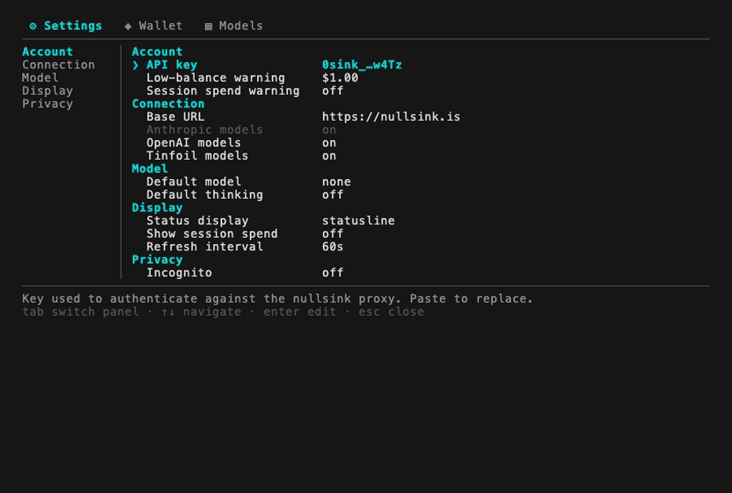

<p align="center"></p>

<h1 align="center">pi-nullsink</h1>

<p align="center"><strong>Anonymous, crypto-paid frontier models — in your terminal.</strong></p>

<p align="center">
  <a href="https://github.com/11Abu/pi-nullsink/actions/workflows/ci.yml"></a>
  <a href="package.json"></a>
  <a href="LICENSE"></a>
  <a href="CONTRIBUTING.md"></a>
  <a href="https://pi.dev/packages/pi-nullsink?name=nullsink"></a>
</p>

<p align="center">
  <a href="#install">Install</a> ·
  <a href="#usage">Usage</a> ·
  <a href="#funding">Funding</a> ·
  <a href="#privacy">Privacy</a> ·
  <a href="#pricing">Pricing</a> ·
  <a href="#faq">FAQ</a>
</p>

Use frontier **Anthropic**, **OpenAI**, and **Tinfoil** models in the [Pi coding agent](https://pi.dev) —
anonymously, paid in crypto, without ever leaving the terminal. pi-nullsink is the terminal-native
client for [**nullsink**](https://nullsink.is): mint a bearer key, fund it with Monero or Bitcoin,
pick a model, and chat.



## Contents

- [Why nullsink?](#why-nullsink)
- [Install](#install)
- [Usage](#usage)
- [Funding](#funding)
- [Privacy](#privacy)
- [Configuration](#configuration)
- [Pricing](#pricing)
- [Self-hosting](#self-hosting)
- [FAQ](#faq)
- [Development](#development)
- [License](#license)

## Why nullsink?

Using a frontier model normally ties every request to you: an account, an API key in your name, a
credit card, and prompts logged against your identity.

And those prompts are more than a paper trail. Increasingly, your prompts *are* your source code — an
agent can rebuild your app from them. Sitting in a provider's logs, they're the blueprint to your
product, handed over one request at a time.

[**nullsink**](https://nullsink.is) removes the identity. It's an anonymous, account-less,
crypto-paid **metered reverse proxy** for frontier models — **no account, no IP logs, no request
logs**. Your money *is* a bearer key: you fund it with Monero or Bitcoin, and that key is the only
identity the service ever sees. Nothing links it to you.

nullsink's own mint-and-fund flow runs in a browser. **pi-nullsink brings the whole thing into the
terminal** — mint a key, top up with a live-tracked crypto payment, switch wallets, and change every
setting from a full-screen hub — then call the models through Pi as usual. No browser, no context
switch.

## Install

```sh
pi install npm:pi-nullsink   # install the extension
pi                           # launch — guided setup mints or pastes your key
/nullsink                    # open the hub: balance, top up, models, settings
```

On first launch it runs a short **guided setup** — mint a fresh key right there, paste one you
already have, or skip. No browser required. Your key is saved to `~/.pi/agent/nullsink.json`
(mode `0600`) so you enter it **once** and never again; it persists across sessions and shells.
Re-run any time with `/nullsink setup`.

Prefer environment variables? Set one and setup won't prompt (env always wins over the saved file):

```sh
export NULLSINK_API_KEY=0sink_your_key_here
```

## Usage

Pick a model with `/model` — they appear as **nullsink · Anthropic / OpenAI / Tinfoil** — and chat
as usual. A status line under the editor shows your live balance; check it any time with `/nullsink`.

The extension registers three providers, all authenticated with the same `NULLSINK_API_KEY` and
routed through nullsink's `/v1` proxy:

| Provider | API surface | Models |
| --- | --- | --- |
| `nullsink` | Anthropic Messages | Claude Opus / Sonnet / Haiku / Fable |
| `nullsink-openai` | OpenAI Chat Completions | GPT-5.x, GPT-4.x, o-series |
| `nullsink-tinfoil` | OpenAI Chat Completions (sealed-enclave) | GLM, Kimi, gpt-oss, Llama, Gemma |

The full, current model list is in [`src/models.json`](src/models.json) and via `/nullsink models`.

### The hub

`/nullsink` opens a full-screen, tabbed control panel — everything nullsink.is can do, in the
terminal:

```
/nullsink ─┬─ ⚙ Settings   Account · Connection · Model · Display · Privacy
           ├─ ◈ Wallet     balance · profiles · top up · mint · pending order
           └─ ▤ Models     every served model, filter-as-you-type, pick a default
```

`tab` / `shift-tab` (or `←→` when no row is being edited) switch tabs; `esc` backs out of an inline
edit or wizard step, then closes. Every change applies live and persists immediately, and the footer
always explains the focused item.

### Commands

Each tab is reachable as a subcommand, so you can skip the hub when you know what you want:

- `/nullsink` — open the hub (same as `/nullsink config`).
- `/nullsink balance` — remaining USD credit.
- `/nullsink models` — list every served model, grouped by provider.
- `/nullsink setup` — the guided key setup (mint / paste / skip).
- `/nullsink topup` — fund the active key (amount → coin → pay).
- `/nullsink pay` — reopen the pay screen for a pending order.
- `/nullsink mint` — generate a fresh key locally (shown once).
- `/nullsink help` — the command list.

## Funding

> [!CAUTION]
> Your key is **bearer money** — whoever holds it can spend it, and there are no refunds or account
> recovery. Treat it like cash. It lives owner-only (`0600`) in `~/.pi/agent/nullsink.json`.

nullsink.is's funding flow, rendered natively in the TUI — no browser needed. `/nullsink topup`
(or **◈ Wallet → Top up**) runs a three-step wizard:

1. **Amount** — presets **$10 / $25 / $50 / $100**, or a custom value. Orders are **$2–$100**.
2. **Coin** — pick a pay rail from nullsink's live `/rails` (cached per session; Monero is always
   available as a fallback).
3. **Pay** — a half-block **QR** of the payment URI, the destination address, the exact amount and
   unit, the locked quote, and an expiry countdown. Send the crypto from your own wallet. Press `[t]`
   to hand off to **Trocador AnonPay** and pay in *any* coin — the destination is locked to this
   order's address and amount, and the hand-off carries **no key and no hash**. `esc` backgrounds the
   order; nullsink keeps watching.

While an order is in flight the status line tickers **`⧗ waiting` → `⧗ confirming n/m` →
`⧗ finalizing`**. The order is saved to your profile, so if you close the terminal mid-confirmation
it **resumes automatically** the next time you start Pi (up to a 24h backstop). When the credit lands
you get a notice and the balance updates; `/nullsink pay` reopens the pay screen for a pending order
at any time.

## Privacy

### How your key is handled

Your key **is** your money and your only identity. It's minted **locally** — generated from your
operating system's CSPRNG, so it never has to be created anywhere but your own machine — and saved at
rest in `~/.pi/agent/nullsink.json` (mode `0600`, owner-only), the same directory and trust boundary
as Pi's own credentials. It's shown masked (`0sink_…w4Tz`) in all UI.

The raw key leaves your machine only as the `x-api-key` / `Authorization: Bearer` header to `/balance`
and `/v1`, over TLS — the same way the official Anthropic/OpenAI SDKs send an API key. When you fund
it, the top-up calls (`/buy`, `/order-status`) only ever see `sha256(key)` (lowercase hex), never the
key itself. That same `0600` file also stores **pending-order metadata** for an in-flight top-up
(pay-to address, amounts, coin, quote) so an order can resume across restarts; it holds no secret
beyond the key.

Review nullsink's [trust model](https://github.com/nullsink/nullsink/blob/main/docs/trust-model.md)
for what the service does and does not protect.

## Configuration

The hub's **⚙ Settings** tab groups every setting under a section rail; changes apply live and persist
immediately. A **profile is a named wallet** — its own key and its own pending order, while everything
else is global — so you can switch, add, rename, or delete profiles in **◈ Wallet**.

| Section | Setting | Default | Notes |
| --- | --- | --- | --- |
| Account | API key | — | masked `0sink_…w4Tz`; paste to replace |
| Account | Low-balance warning | `$1.00` | warn in the status line below this |
| Account | Session spend warning | off | warn once when this session's cost crosses it |
| Connection | Base URL | `https://nullsink.is` | self-hosted forks; re-registers providers live |
| Connection | Anthropic / OpenAI / Tinfoil models | all on | show or hide a provider's models in `/model` |
| Model | Default model | none | switches the current session and saves the startup default |
| Model | Default thinking | off | applied at session start (clamped to the model) |
| Display | Status display | `statusline` | `statusline / widget / both / off` |
| Display | Show session spend | off | append this session's nullsink cost to the readout |
| Display | Refresh interval | `60s` | post-turn balance re-check throttle (min 15) |

**Environment overrides win.** `NULLSINK_API_KEY` beats the active profile's key and
`NULLSINK_BASE_URL` beats the saved Base URL; when either is set the matching row is shown read-only
with an `(env)` tag, and env-only users never see a setup prompt.

The **balance readout** updates on session start, after balance / config / wallet actions, and
(throttled) after each turn — never adding per-message latency:

- `● $42.50` — funded.
- `⚠ $0.80 · top up` — below your threshold.
- `⚠ unfunded · /nullsink topup` — key set, no confirmed deposit.
- `⚠ balance unavailable` — couldn't reach nullsink.
- `○ no key · /nullsink setup` — no key yet.

A `⧗ …` order suffix decorates the line as needed.

**No TUI?** Every command still works: the hub falls back to a dialog menu (or plain text). `mint`
prints your new key once plus a funding hint; `topup` / `pay` print the address, amount, payment URI,
and a scannable text QR as plain lines.

## Pricing

Per-request cost shown in Pi matches what nullsink actually deducts from your balance. nullsink meters
**pure upstream cost with no markup** — the small margin is applied only when you top up, not per
request ([billing model](https://github.com/nullsink/nullsink/blob/main/docs/billing-model.md)). The
cost table in [`src/models.json`](src/models.json) is taken verbatim from nullsink's own price
snapshot, so Pi's spend readout and your balance stay in agreement.

> Every request must set a max output tokens — Pi always does, so this is automatic.

## Self-hosting

Running your own nullsink deployment? Point the extension at it:

```sh
export NULLSINK_BASE_URL=https://your-instance.example
```

The default is `https://nullsink.is`. The value may be the origin (`https://host`) or the OpenAI base
(`https://host/v1`) — both resolve correctly. You can also set it interactively via the hub's
**Connection → Base URL** row, which re-registers the providers immediately.

## FAQ

<details>
<summary><strong>Is it actually anonymous?</strong></summary>

nullsink keeps no account, no IP logs, and no request logs — your bearer key is the only identity it
ever sees, and you fund it with crypto. That removes the *account* and *billing* trail. It does **not**
hide your network origin on its own, and it can't change your *money* origin — Monero hides the
sender on-chain, Bitcoin does not.
</details>

<details>
<summary><strong>What if I lose my key?</strong></summary>

The key **is** the money — there is no account and no recovery. It lives at `~/.pi/agent/nullsink.json`
(owner-only, `0600`); back it up like cash. Anyone who holds it can spend the balance.
</details>

<details>
<summary><strong>How is this different from using the OpenRouter/Anthropic/OpenAI API directly?</strong></summary>

Used directly, every request is tied to you: an account, an API key in your name, a card, and prompts
logged against your identity. Through nullsink there is no account, no card, and no request logs — and
since [your prompts are your source code](#why-nullsink), keeping them out of a provider's logs is the
whole point.
</details>

<details>
<summary><strong>Do you mark up each request?</strong></summary>

No. nullsink meters **pure upstream cost with no per-request markup**; the small margin is applied once,
when you top up. The cost table in [`src/models.json`](src/models.json) is nullsink's own price snapshot,
so Pi's spend readout and your balance stay in agreement. See [Pricing](#pricing).
</details>

<details>
<summary><strong>My top-up didn't confirm — now what?</strong></summary>

Nothing to do — the order is saved to your profile and **resumes automatically** the next time you start
Pi (up to a 24h backstop). `/nullsink pay` reopens the pay screen anytime. When an order closes, your
`/balance` is the authoritative outcome. See [Funding](#funding).
</details>

<details>
<summary><strong>Can I run my own nullsink?</strong></summary>

Yes — point the extension at your instance with `NULLSINK_BASE_URL=https://your-instance`, or set it in
the hub's **Connection → Base URL**. See [Self-hosting](#self-hosting).
</details>

## Development

> [!WARNING]
> **`src/models.json` is generated — never hand-edit it.**

Regenerate it from nullsink's price snapshot (cost) joined with [models.dev](https://models.dev)
(capabilities):

```sh
bun run sync:models   # rewrites src/models.json
git diff src/models.json
```

The script fails loudly if nullsink prices a model that models.dev doesn't yet describe, so a new
model never ships with guessed context/output limits.

```sh
bun run typecheck     # tsc --noEmit
bun test              # unit tests for the pure core
```

Architecture and the nullsink API contract are documented in [`docs/design.md`](docs/design.md);
see [`CONTRIBUTING.md`](CONTRIBUTING.md) before opening a PR.

## License

MIT — see [`LICENSE`](LICENSE). nullsink itself is AGPL-3.0-or-later; this is an independent client
extension.
