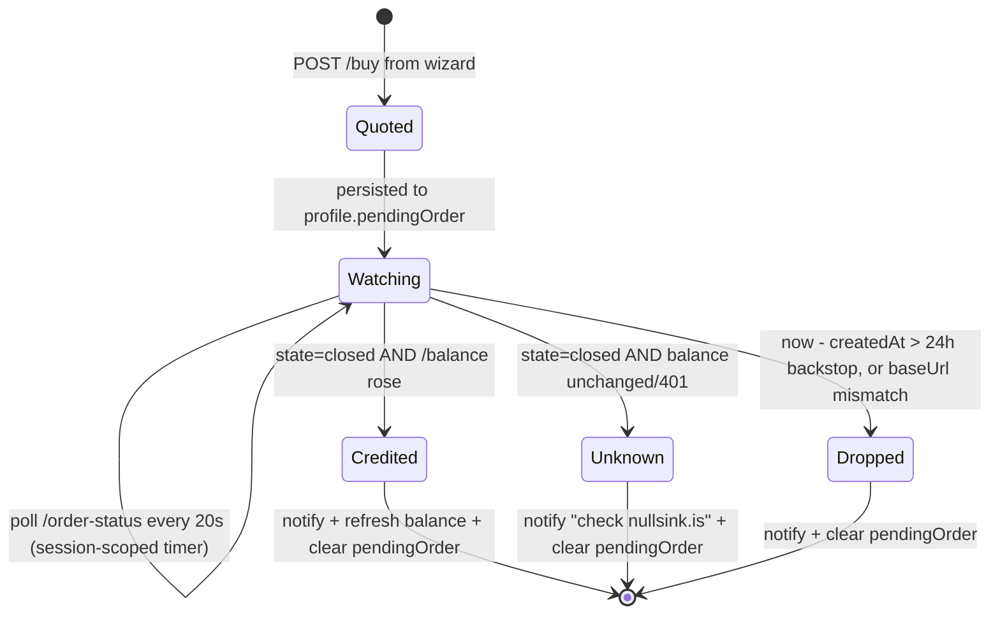

# pi-nullsink v0.2 — full terminal client

Design for turning the extension from "provider + balance readout" into a full terminal client
for nullsink: mint and top up in the terminal (nullsink.is's own flow, rendered in the TUI),
an OMP-style tabbed settings hub, key profiles, and an incognito mode. Approved 2026-07-02.
Supersedes the panel/config portions of `2026-07-01-config-and-ui-design.md`; its store/env
precedence and balance-cadence decisions carry forward unchanged.

## Goal

Everything nullsink.is can do, in the terminal. The browser flow exists because keys are minted
client-side and funded by paying a quoted crypto amount — both are plain HTTP + local computation,
so a TUI can drive them natively. No new trust is added: the raw key still leaves the machine only
to `/balance` and `/v1`, money still moves only person → nullsink address via the user's own wallet.

## Scope

- **In:** native mint; top-up wizard (amount → rail → QR/address pay screen); live order ticker +
  cross-session resume; Trocador any-coin hand-off; tabbed `/nullsink` hub (Settings / Wallet /
  Models); key profiles; incognito mode (badge + action + `always`); default model + thinking
  level; provider on/off; session spend display + warning; low-balance threshold; refresh interval.
- **Out (parked for v2):** wallet-RPC auto top-up (custody risk), semi-auto quote-on-low-balance
  (burns operator rate-locks on unpaid quotes), Tinfoil attestation verification, clipboard copy
  of the key (leak surface; the `0600` file is the durable copy).

## nullsink API contract (verified against `client/src/lib/api.ts`, 2026-07-02)

| Call | Auth | Purpose |
| --- | --- | --- |
| `GET /rails` | none | Active pay rails `{ default, rails: [{ name, unit, confirmations }] }` |
| `POST /buy { hash, credit_usd, rail? }` | none | One-time quote: `pay_to`, verbatim `amount`, `unit`, `pay_uri`, `rate_usd`, `confirmations_required`, `expires_at` |
| `POST /order-status { hash }` | none | `waiting \| confirming \| finalizing \| closed` + `confirmations/required`, `received/expected` |
| `GET /balance` | `x-api-key` (raw) | `{ balance_usd }`; 401 = unknown-or-unfunded |

Invariants we inherit and must preserve:

- **Hash discipline.** `/buy` and `/order-status` only ever see `sha256(token)` (lowercase hex).
  The raw token goes on the wire solely to `/balance` and `/v1`.
- **Amounts are verbatim strings.** Display `amount` / `received` / `expected` exactly as sent —
  never parse, round, or reformat.
- **Limits.** $2 min, $100 max per order, presets 10/25/50/100. Mirror client-side; the server
  stays authoritative. `/buy` errors map to calm copy (rate_unavailable, rate_limited, …); never
  auto-retry a 429.
- **`closed` is ambiguous** (credited, reaped, or never existed — link dropped at settle). On
  `closed`, `/balance` is the authoritative outcome.

## Token format (clean-room reimplementation)

`"0sink_" + base64url(32 random bytes, no padding — 43 chars) + 4-char checksum`, where the
checksum is FNV-1a/32 over the 43 chars, low 24 bits, encoded via the base64url alphabet.
Shape gate: `^0sink_[A-Za-z0-9_-]{47}$`, then checksum compare. Hash identity:
`sha256(whole token)` → 64-char lowercase hex.

Randomness comes from the platform CSPRNG — never `Math.random`; the 43 chars are the entire
256-bit security. The checksum is a typo guard only. Paste validation now checks the checksum,
not just the regex (a typo'd token funds an unspendable hash — unrecoverable by design).

Licensing: nullsink is AGPL-3.0; this repo is MIT. We reimplement from the observable format
facts above (interoperability spec, not copied expression). Correctness is pinned by recorded
vectors generated with nullsink's own algorithm (see Testing).

## Config schema v2 — profiles

`~/.pi/agent/nullsink.json`, mode `0600`, atomic replace on write:

```jsonc
{
  "version": 2,
  "activeProfile": "default",
  "profiles": {
    "default": {
      "apiKey": "0sink_…",
      "pendingOrder": {            // absent when none
        "hash": "…64 hex…",        // sha256 of the profile's token
        "baseUrl": "https://nullsink.is",  // instance the quote came from
        "creditUsd": 25, "rail": "monero", "unit": "XMR",
        "payTo": "…", "amount": "0.147201", "payUri": "monero:…",
        "expiresAt": 1730000000000, "createdAt": 1730000000000
      }
    }
  },
  "baseUrl": "https://nullsink.is",
  "display": "statusline",                   // statusline | widget | both | off
  "defaultModel": null,                      // model id or null
  "thinkingLevel": null,                     // pi ThinkingLevel or null
  "providers": { "anthropic": true, "openai": true, "tinfoil": true },
  "lowBalanceUsd": 1,
  "spendWarnUsd": null,                      // null = off
  "showSpend": false,
  "refreshSeconds": 60,
  "incognito": "off",                        // off | always
  "setupDone": true
}
```

- A **profile is a named wallet**: key + its pending order. Everything else is global.
- **Migration:** a v1 file (`{ apiKey, baseUrl, display, setupDone }`) is wrapped into
  `profiles.default` on first load and rewritten as v2. Unknown fields are preserved on rewrite
  (forward compatibility). Garbage fields fall back to defaults per field, never whole-file reject.
- **Env precedence unchanged:** `NULLSINK_API_KEY` beats the active profile's key;
  `NULLSINK_BASE_URL` beats `baseUrl`. Env-only users never see setup prompts.

## The `/nullsink` hub (TUI)

One full-screen `ctx.ui.custom` component with three top tabs — **⚙ Settings · ◈ Wallet ·
▤ Models** — modeled on OMP's settings window. `tab`/`shift-tab` (and `←→` when no row edit is
active) switch tabs; `esc` closes (or backs out of an inline edit/wizard step first). Every
change applies live and persists immediately. Footer always shows: description of the focused
item + key hints.

### Settings tab

Left rail = section jump-nav (`Account / Connection / Model / Display / Privacy`), highlight
follows scroll; right pane = all rows under section headers, `name  value` columns.

| Section | Row | Type / behavior |
| --- | --- | --- |
| Account | API key | masked `0sink_…w4Tz`; enter → inline editor; checksum-validated, confirm on mismatch |
| Account | Low-balance warning | USD; inline editor, ≥ 0 |
| Connection | Base URL | inline editor; URL-validated; re-registers providers live; env-override shown read-only with `(env)` tag |
| Connection | Anthropic / OpenAI / Tinfoil models | on/off toggles; unregister/register providers live; **blocked** with a notice if the current session model belongs to the provider being disabled |
| Model | Default model | enter → jumps to Models tab in "pick default" mode |
| Model | Default thinking | cycles pi thinking levels (clamped to model caps at apply time) |
| Display | Status display | cycles `statusline / widget / both / off` |
| Display | Show session spend | on/off |
| Display | Refresh interval | seconds; inline editor, clamped ≥ 15 |
| Privacy | Incognito | cycles `off / always` |

Enum rows cycle on `enter` / `←→`; text/number rows open a one-line inline editor beneath the row
(pi-tui `Editor`), `enter` commits, `esc` cancels. Invalid input keeps the editor open with the
error in the footer.

### Wallet tab

Header: `Balance ● $42.50 · Profile: default`. Rows/actions:

- **Profile** — switch / new / rename / delete (delete confirms; deleting the active profile
  switches to another or clears).
- **Top up** — the wizard, nullsink.is's flow verbatim:
  1. Amount: presets `$10 $25 $50 $100` + custom (validated 2–100).
  2. Rail: from `GET /rails` (cached per session; fallback Monero-only, same as the web client).
  3. Pay screen: half-block **QR of `pay_uri`** (via `uqr`), address, verbatim amount + unit,
     locked rate, expiry countdown, live status line; `[t]` opens the pre-filled Trocador AnonPay
     URL in the browser (destination locked to this order's address/amount; carries no token, no
     hash); `esc` backgrounds the order.
- **Pending order** — visible whenever one exists: `⧗ confirming 4/10 · $25 · expires 19:42`;
  enter reopens the pay screen. `/nullsink pay` deep-links here.
- **Mint new key** — generate → show the full token **once** with a "this is your money, save it
  now; it is stored in ~/.pi/agent/nullsink.json (0600)" notice → save as new profile (or into the
  active empty one) → offer to fund it (jumps to Top up step 1).
- **Check balance now**, **Re-run setup**, **Clear saved config** (moved here from the old menu).

### Models tab

Filterable list (type-to-filter), grouped by provider, columns: id · context · in/out $ per MTok.
`enter` = set as default model (and, in pick-default mode, returns to Settings). Data source:
`src/models.json` — unchanged.

### Non-TUI fallback

`ctx.mode !== "tui"`: the hub is unavailable; the existing dialog-chain menu (extended with the
new fields), and `topup`/`mint`/`pay` print address + amount + `pay_uri` + a text QR as plain
lines. RPC mode gets dialogs; print mode gets text only. Feature parity, lower fidelity.

## Order lifecycle in the extension



- Polling only while a session is live; `session_shutdown` clears the timer. On `session_start`,
  a persisted pending order (age ≤ 24h, matching baseUrl) resumes the ticker silently.
- Statusline while watching: `⧗ waiting` → `⧗ confirming n/m` → `⧗ finalizing`. The pay screen,
  when open, shows the same states plus received/expected amounts verbatim.
- Poll failures are silent (next tick retries); the ticker shows the last known state.

## Incognito

- **Badge:** `getSessionFile() === undefined` (native `pi --no-session`) or our replacement
  succeeded → statusline prefix `⦿ incognito`.
- **Action** ("Start incognito session now", also `/nullsink incognito`): `ctx.newSession({ setup })`;
  in setup, `sessionManager.setSessionFile("/dev/null")` and unlink the just-created stub file.
  Public-but-internal API: wrapped in try/catch; on failure, notify "couldn't go incognito — run
  `pi --no-session`" and leave the session as-is. A live smoke test gates every release.
- **`always`:** at `session_start`, replace only **fresh** sessions (no prior user/assistant
  entries). Resumed/continued sessions are never replaced — notice instead ("this resumed session
  is still being saved; start fresh for incognito"). After replacement, notify once with the badge.
- **Boundary (documented in README + panel description):** stops Pi's transcript persistence.
  Terminal scrollback, shell history (`pi "prompt"` argv), and files the agent edits are outside
  it. The network side is nullsink's existing no-account/no-logs model. Our own config writes
  (key, pending order) are settings, not transcript, and continue.

## Model / provider behaviors

- **Default model + thinking:** applied once per session at `session_start` via
  `pi.setModel(...)` / `pi.setThinkingLevel(...)`, only when the configured model's provider is
  enabled and the key resolves. Mid-session `/model` choices are never overridden.
- **Provider toggles:** `registerProvider`/`unregisterProvider` immediately; the guard above
  protects the in-use provider.
- **Session spend:** on `turn_end`, sum cost from the session's assistant entries for
  nullsink-registered models (usage costs already derive from our exact `models.json` rates).
  `showSpend` appends `· spent $0.83` to the readout. Crossing `spendWarnUsd` notifies once per
  session.

## Balance readout (unchanged cadence, new states)

Fetch on `session_start`, after config edits and wallet actions, throttled (`refreshSeconds`,
min 15) after `turn_end`. States: `● $42.50` · `⚠ $0.80 · top up` (below `lowBalanceUsd`) ·
`⚠ unfunded` (401) · `○ no key` · plus `⧗ …` order suffix and `⦿ incognito` prefix as above.

## Module layout

- `token.ts` — NEW pure leaf: generate / checksum / validate / sha256-hex. No imports beyond
  platform crypto.
- `wallet.ts` — NEW: nullsink money API client (`rails`, `buy`, `orderStatus`, `balance`) +
  the order-watch reducer (pure state machine; timers injected).
- `store.ts` — v2 schema, migration, atomic write, profile CRUD.
- `config.ts` — pure: precedence, masking, validation, all row/label/status renderers.
- `ui/hub.ts` — NEW: the tabbed component (Settings / Wallet / Models), built from pure
  row-model + key-reducer functions; rendering kept as thin string composition
  (`visibleWidth`-aware two-column layout).
- `index.ts` — wiring only: events, commands (`balance · models · setup · config · topup ·
  mint · pay · incognito · help`), provider (re)registration, timers.
- New runtime dependency: `uqr` (MIT, zero-dep) for QR matrices; rendered as Unicode half-blocks.

## Testing

- **Pure units (bun test):** token generate/validate/hash against **recorded vectors produced by
  nullsink's own `token-format.ts`** (vectors committed, generator script noted in a comment);
  config v2 parse + v1 migration + unknown-field preservation; precedence; every readout state
  incl. order/incognito decorations; order-watch reducer (all transitions incl. backstop, baseUrl
  mismatch, closed-ambiguity); Trocador URL builder (param-exact vs. their implementation); buy
  error-code → copy mapping; QR half-block renderer (golden lines for a known matrix).
- **Mock nullsink (bun test):** in-process HTTP server implementing the four endpoints with
  scripted progressions (waiting→confirming→closed+credit; reap; 429; malformed). Drives the
  wallet client + watcher end to end, including resume-from-config.
- **Live smoke (manual, gates publish):** real pi TUI — hub tabs render + edit; mint (leave
  unfunded); incognito action + always-mode fresh/resumed paths; a paid $2 order end-to-end on
  the real service.

## Risks

- **Incognito rides internal-ish Pi API** — mitigated: try/catch + fallback message + release-
  gating smoke test; TS-public methods only (`setSessionFile`), no private pokes.
- **Panel size** — the hub is the largest component we'll own (~600–800 lines with wizard);
  contained by keeping ALL decision logic in pure tested functions; the component is dumb
  render + dispatch.
- **Unpaid quotes cost the operator** (rate-lock + watch address) — top-up is always explicit;
  we never auto-create orders.
- **`/buy` global rate limit** — surface calm copy, manual retry only.
- **Multi-instance forks** — pending orders pin their `baseUrl`; a mismatch drops the order
  rather than polling the wrong host.

## v2 parking lot

Wallet-RPC true auto top-up · semi-auto quote-on-threshold · Tinfoil attestation check ·
per-model favorites · widget placement.
